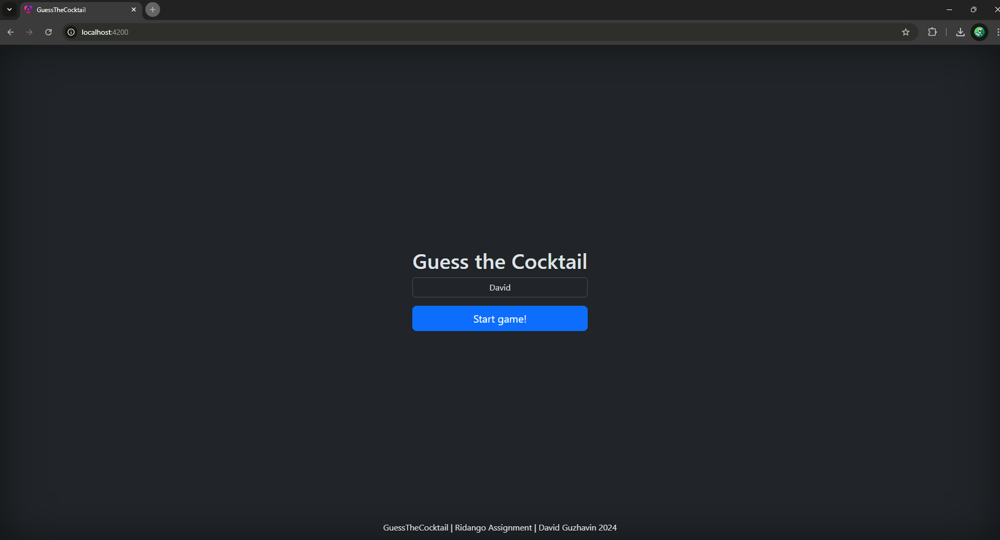
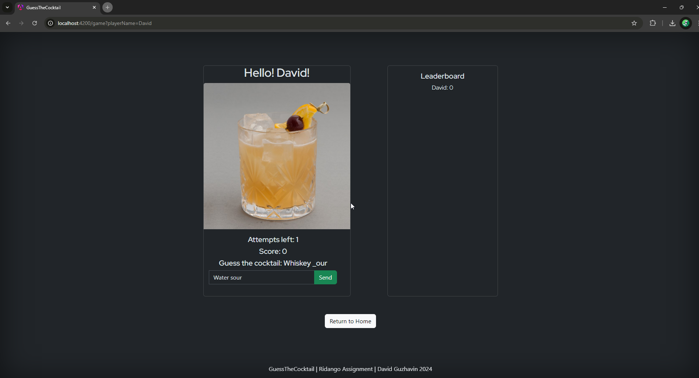
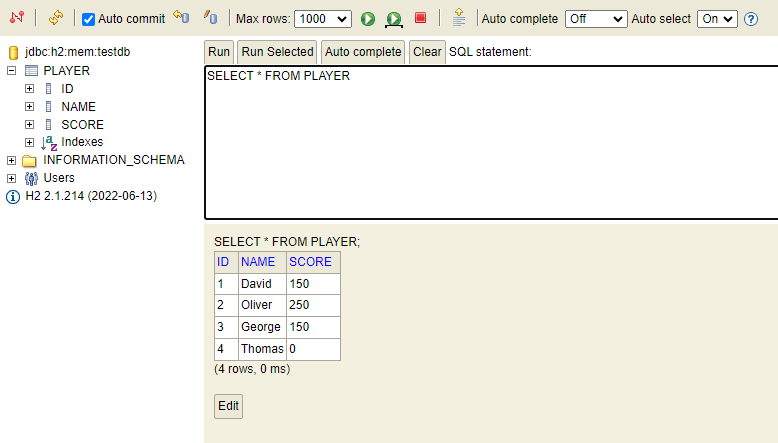
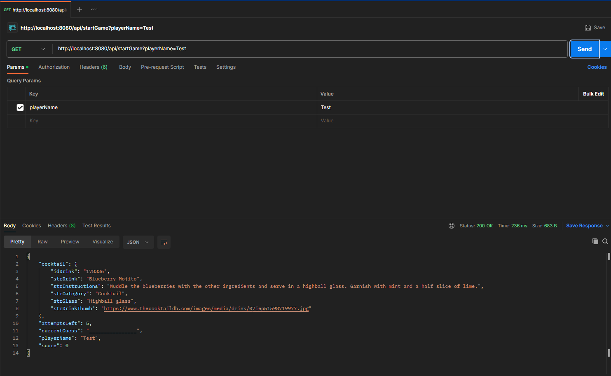

# Guess the Cocktail Game

## Overview

This project is a web application that allows users to play a cocktail guessing game. The application is built with a Java Spring Boot backend and an Angular frontend. The backend runs on `localhost:8080` and uses an H2 database for data storage. The frontend communicates with the backend using Angular's `HttpClient`.

## Backend

The backend is developed using Java and Spring Boot. It provides RESTful APIs for the frontend to interact with. The backend handles game logic, user management, and data persistence. The application runs on `localhost:8080` and uses an H2 in-memory database, which is convenient for development and testing purposes.

### Key Features

- **Game Logic**: The backend manages the game state, including the current cocktail to guess, the number of attempts left, and the player's score.
- **User Management**: Users can "log in" by entering their name or nickname. While a full registration system with passwords could be implemented, it was not included due to time constraints.
- **Scoreboard**: The backend maintains a scoreboard that tracks the scores of all users.

## Frontend

The frontend is built with Angular and communicates with the backend using `HttpClient`. It provides a user-friendly interface for playing the game and viewing the scoreboard.

### Key Features

- **Login**: Users can enter their name or nickname to start the game.
- **Game Interface**: Users can guess the name of the cocktail based on an image and receive feedback on their guesses.
- **Scoreboard**: Users can view the scores of other players.

## Testing and Bug Fixes

Extensive testing was conducted to ensure the application works as expected. Several bugs were identified and fixed, including:

- **Negative Scores**: A bug where scores could go below zero was fixed.
- **UI Improvements**: Various UI improvements were made to enhance the user experience.

## Known Issues

- **Complex Words**: Sometimes the words to guess are very complex.
- **Full Reveal**: Occasionally, words are fully revealed without using all attempts.

## How to Run

1. **Backend**: 
   - Navigate to the backend directory.
   - Run the Spring Boot application using `./gradlew bootRun`.
   - The backend will be available at `http://localhost:8080`.

2. **Frontend**:
   - Navigate to the frontend directory.
   - Install dependencies using `npm install`.
   - Run the Angular application using `ng serve`.
   - The frontend will be available at `http://localhost:4200`.

## Conclusion

This project demonstrates a simple yet functional web application with a Java Spring Boot backend and an Angular frontend. It includes basic user management, game logic, and a scoreboard. While a full registration system was not implemented, the current setup allows users to quickly start playing the game by entering their name or nickname.

